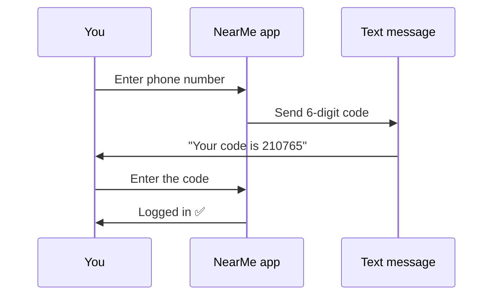
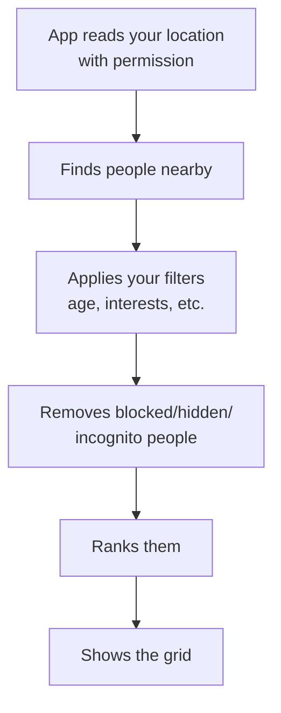
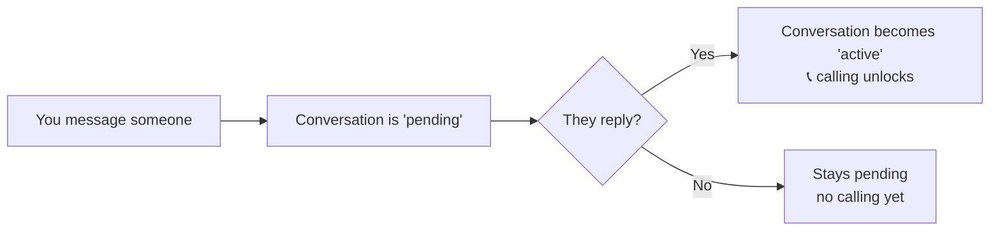
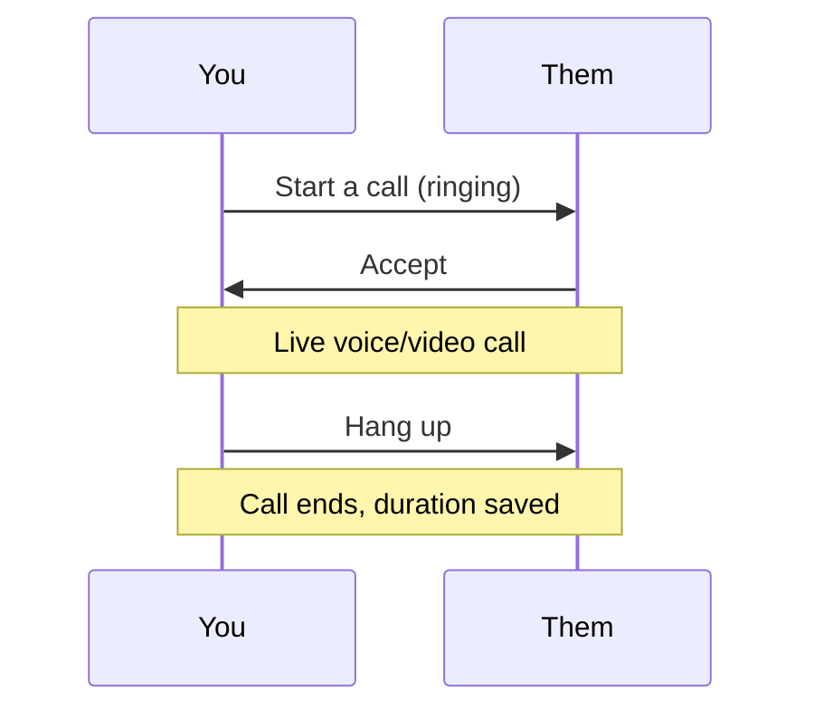
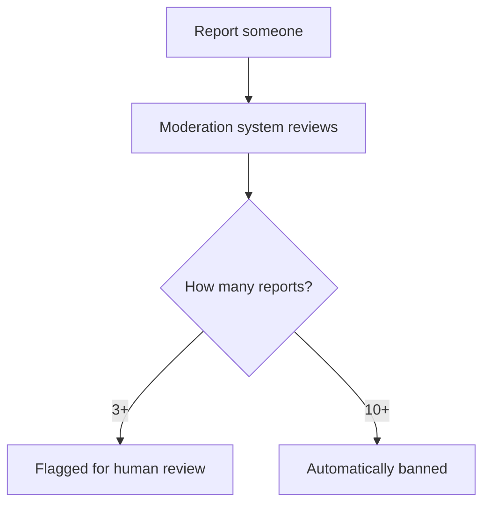
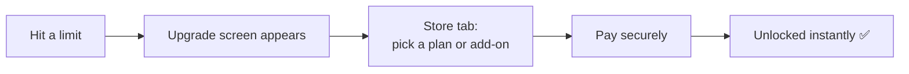

# NearMe — Feature Guide

*A plain-English walkthrough of every feature, with simple diagrams. For product, ops, support, QA, and anyone who needs to understand how the app actually behaves — no coding required.*

> New here? Read `PRODUCT_OVERVIEW.md` first for the big picture, then come back for the details.

---

## 1. Signing up & logging in

NearMe uses **phone numbers, not passwords**. You get a one-time code by text.

- Codes expire after a few minutes.
- For safety, only a few code requests are allowed per phone in a short window, and too many wrong guesses temporarily locks the attempt.
- New users go straight into building their profile; returning users land on the home grid.

---

## 2. Building your profile

After signing up, you set up who you are: **name, age, gender & identity, what you're looking for, and a photo.** You can later add a bio, more photos, interests, "prompts" (fun Q&A), and (on paid plans) voice/video clips.

**Profile completeness matters:** the more complete your profile, the higher you rank in other people's grids. Each piece (photo, bio, interests, etc.) adds to a completeness score.

---

## 3. Discovering people nearby (the Grid)

The heart of the app. You see a **live grid of people near you**, closest and most relevant first.

**How people are ranked (who shows first):**
1. People who bought a **boost** (paid visibility)
2. Then by plan — **Platinum → Gold → Premium → Free**
3. Then by **distance** (closer first)
4. Then by **profile completeness** and **how often they reply**

**Privacy in the grid:** you never see anyone's exact location — only a rounded distance like *"0.8 km away."* The same protection applies to you.

**Filters** let you narrow by age, height, body type, interests, and what people are looking for. Some advanced filters (verified-only, "active in the last 5 minutes," high reply rate) are reserved for paid plans.

---

## 4. Messaging & the reply gate

You can message anyone in the grid. But there's an important rule that keeps things respectful:

- **Calling is reply-gated:** you can't voice/video call someone until they've replied at least once. This stops one-sided spam.
- **Free users** can start conversations with up to **20 different people total** — upgrading removes this cap.
- Conversations live in your **Inbox**, split into your active chats and pending requests.

**Message extras:**
- **Edit** a message (within ~5 minutes of sending)
- **Unsend** a message
- **Expiring photos** — a photo that vanishes after it's viewed once (limited per day on free plans)
- **Translate** a message into your language
- **Read receipts** and **typing indicators** (paid plans)

---

## 5. Voice & video calls

Once a conversation is active (they replied), a call button appears.

- **Free plans** get limited call minutes per day (a few minutes of audio, less of video). When the limit is reached mid-call, the call ends automatically and politely.
- **Paid plans** get unlimited calls; **add-ons** can top up minutes.
- You can **schedule a call** for later and get a reminder shortly before it starts.
- Calls drop instantly if either person blocks the other mid-call.

---

## 6. Safety & privacy tools

Safety is front and center. Every user has these tools:

- **Block** — hides the person, ends any active call, and stops all contact both ways.
- **Mute** — silences someone without them knowing.
- **Report** — flags spam, harassment, fake profiles, hate, etc. Repeat offenders are auto-banned; hate speech gets prioritized.
- **Panic hide** — one tap instantly removes you from the grid and pauses incoming messages (great for an uncomfortable moment).
- **Privacy toggles** — go incognito (Gold+), hide your exact distance, hide your last-seen and active status.
- **Content screening** — messages and images can be automatically checked for abusive or explicit content.

---

## 7. Verification & trust badges

Users can prove they're real to earn trust:

| Verification | How |
|---|---|
| **Phone** | Automatic when you sign up |
| **Photo** | Submit a selfie; it's checked |
| **Face** | Submit a short video selfie; once approved you get the **Verified** badge |
| **College** | Confirm a college email with a code |
| **Identity** | Government ID via DigiLocker or Stripe Identity |

Verified users stand out and can be prioritized by people who filter for "verified only."

---

## 8. Albums & photos

- Organize photos into **albums** with cover images.
- View other users' public albums from their profile.
- (Private album sharing exists in the system for granting specific people access.)

---

## 9. Plans, upgrades & add-ons

When a free user hits a limit (e.g., the 20-person messaging cap), the app shows an **upgrade screen**.

**Subscriptions** (monthly, 3-month, 6-month, or annual):
- **Premium** — unlimited messaging, more profile space, worldwide Explore search, typing indicators.
- **Gold** — adds "who viewed me," incognito mode, call history, pinned chats, travel mode.
- **Platinum** — adds AI features (icebreakers, reply suggestions, daily top-10 picks, profile optimizer).

**Add-ons** (one-time, any plan): boosts (local / extended / city-wide / mega), spotlight, chat packs, travel passes, extra audio/video call minutes, verified badge.

Subscriptions auto-expire at the end of the cycle and the account returns to Free unless renewed.

---

## 10. Explore & travel mode (paid)

- **Explore** (Premium+) — search beyond your immediate area, even worldwide, and get a curated "For You" set based on shared interests.
- **Travel mode / City profiles** (Gold+) — set up a presence in a city *before* you arrive, with a "visiting soon" badge.

---

## 11. AI features (Platinum)

For Platinum members who opt in:
- **Icebreakers** — suggested opening messages.
- **Reply suggestions** — ideas for what to say next.
- **Compatibility score** — how well you match someone, based on shared intentions and interests.
- **Daily Top 10** — a curated set of profiles picked for you each day.
- **Profile optimizer** — tips to improve your profile.

---

## 12. Real-time touches

The app feels alive because of instant updates behind the scenes:
- New messages appear immediately.
- You see when someone is **typing** (paid plans).
- Incoming **call invites** pop up instantly.
- The grid reflects who's **online right now**.
- You get notified when someone **taps** (likes) you.

---

## 13. What's not built yet

A few areas are placeholders or partially complete today:
- **"Right Now" and "Interest" tabs** — coming soon (currently empty).
- **Explore map UI** — the "set location" map isn't built yet.
- **Photo/clip uploading** — the screens exist, but the actual file-upload step still needs wiring.
- **Prompts selection UI, album drag-to-reorder, travel-mode UI** — backend ready, app screens pending.
- **End-to-end message encryption** — the system is designed for it, but messages are currently sent as plain text.

---

## Quick reference: limits by plan

| Capability | Free | Premium | Gold | Platinum |
|---|---|---|---|---|
| Browse nearby grid | ✅ (capped count) | ✅ larger | ✅ unlimited | ✅ unlimited |
| Start conversations | 20 people total | unlimited | unlimited | unlimited |
| Bio length | 150 chars | 400 | 600 | 600 |
| Daily call minutes | a few (audio/video) | unlimited | unlimited | unlimited |
| Pinned chats | 0 | 0 | 5 | 10 |
| Who viewed me | — | — | ✅ | ✅ |
| Incognito mode | — | — | ✅ | ✅ |
| Worldwide Explore | — | ✅ | ✅ | ✅ |
| Typing indicators | — | ✅ | ✅ | ✅ |
| AI features | — | — | — | ✅ |

*(Exact numbers are configurable and may change; this reflects the current setup.)*

---

*Technical details for engineers live in `../technical/BACKEND.md` and `../technical/FRONTEND.md`.*
