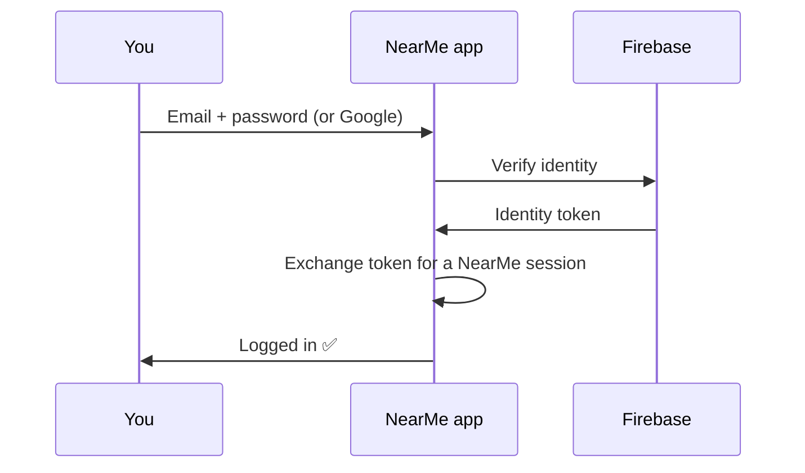
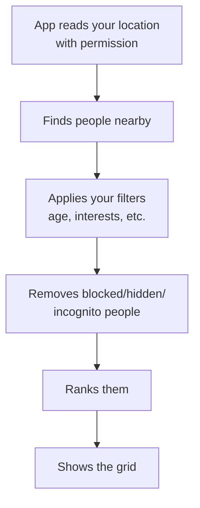
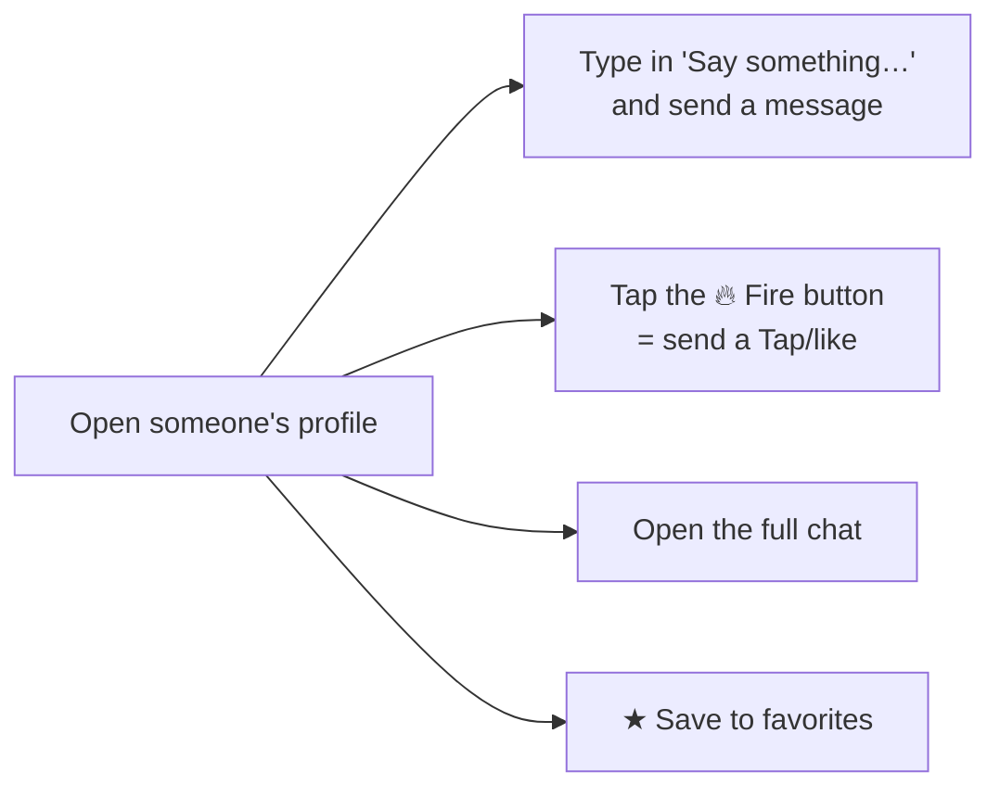
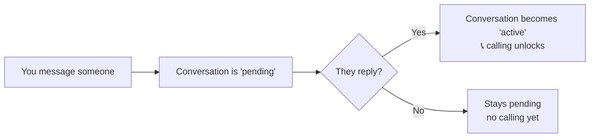
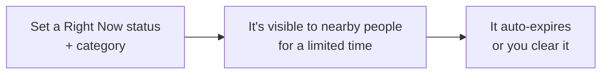
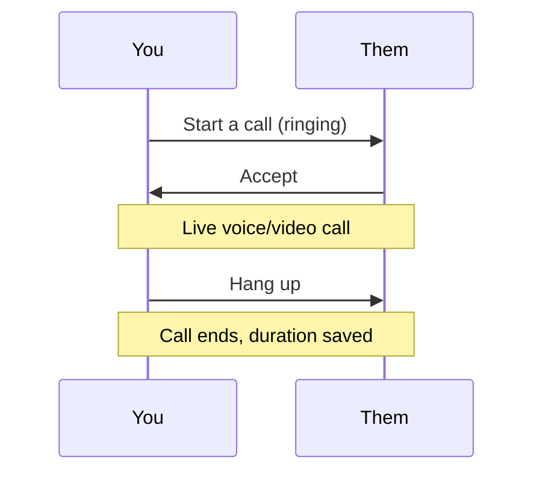
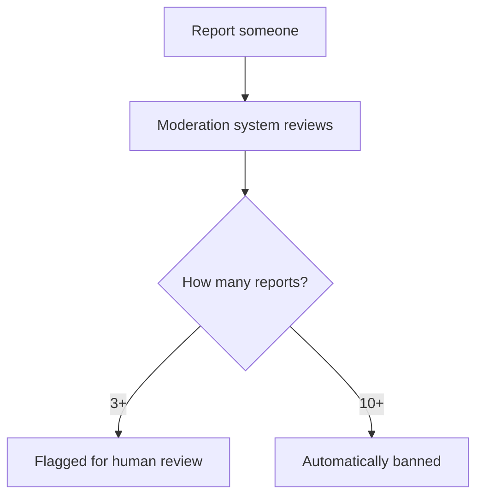
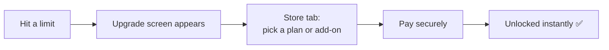

# NearMe — Feature Guide

*A plain-English walkthrough of every feature, with simple diagrams. For product, ops, support, QA, and anyone who needs to understand how the app actually behaves — no coding required.*

> New here? Read `PRODUCT_OVERVIEW.md` first for the big picture, then come back for the details.

---

## 1. Signing up & logging in

NearMe signs you in with **Firebase** — either an **email and password** or **"Continue with Google."**

- Your login session is kept securely on the device and refreshes itself in the background, so you stay signed in.
- New users go straight into building their profile; returning users land on the home grid.

> *(An older phone/SMS code login still exists in the codebase but is no longer the active sign-in method.)*

---

## 2. Building your profile

After signing up, you set up who you are: **name, age, gender & identity, what you're looking for, and a photo.** You can later add a bio, more photos, interests, "prompts" (fun Q&A), and (on paid plans) voice/video clips.

**Profile completeness matters:** the more complete your profile, the higher you rank in other people's grids. Each piece (photo, bio, interests, etc.) adds to a completeness score.

---

## 3. Discovering people nearby (the Grid)

The heart of the app. You see a **live grid of people near you**, closest and most relevant first.

**How people are ranked (who shows first):**
1. People who bought a **boost** (paid visibility)
2. Then by plan — **Platinum → Gold → Premium → Free**
3. Then by **distance** (closer first)
4. Then by **profile completeness** and **how often they reply**

**Privacy in the grid:** you never see anyone's exact location — only a rounded distance like *"0.8 km away."* The same protection applies to you.

**A green dot** appears on people who are **online right now**, both on grid tiles and on their profile, so you can see who's active.

**Tapping a tile opens that person's full profile** (it does *not* jump straight into a chat). From there you decide whether to tap, like, or message them — see the next section.

**Filters** let you narrow by age range, height, body type, interests, online/Right-Now status, favorites, and what people are looking for. The age and height ranges use a draggable dual-handle slider. Some advanced filters (verified-only, "active in the last 5 minutes," high reply rate) are reserved for paid plans.

---

## 3b. Viewing a profile (and acting on it)

When you tap someone on the grid, you land on their **profile page**, showing their photos, name & age, online status, bio/"About me", stats, interests, prompts, and any **albums** they've shared.

From the profile you can act immediately, without going to the Inbox first:

- **Say something…** — a text box at the bottom lets you send a first message right there. A confirmation appears and you stay on the profile.
- **🔥 Fire / Tap** — sends a lightweight "I'm interested" tap; it shows up in the other person's **Interest → Taps**.
- **Chat** — opens the full conversation thread.
- **★ Favorite** (top of the screen) — saves them to revisit later.
- **⋯ Menu** — report or block.

**Important:** simply opening someone's profile counts as a **profile view** for them (unless you're browsing in incognito). That's how the "Views" list stays accurate — see §4b.

---

## 4. Messaging & the reply gate

You can message anyone in the grid. But there's an important rule that keeps things respectful:

- **Calling is reply-gated:** you can't voice/video call someone until they've replied at least once. This stops one-sided spam.
- **Free users** can start conversations with up to **20 different people total** — upgrading removes this cap.
- Conversations live in your **Inbox**, split into your active chats and pending requests.

**Message extras:**
- **Edit** a message (within ~5 minutes of sending)
- **Unsend** a message
- **Expiring photos** — a photo that vanishes after it's viewed once (limited per day on free plans)
- **Translate** a message into your language
- **Read receipts** and **typing indicators** (paid plans)

---

## 4b. Interest — who's into you (Views & Taps)

The **Interest** tab shows the attention you're getting, using **real activity** — nothing here is fake or sample data.

| Tab | What it shows | How it fills up |
|---|---|---|
| **Views** | People who opened your profile | Recorded automatically when someone taps your tile and lands on your profile |
| **Taps** | People who sent you a 🔥 tap/like | Recorded when someone taps the Fire button on your profile (or taps back) |

- The counts next to each tab ("Taps 3") update on their own as people interact with you.
- **Taps** are visible to everyone, and you can **tap back** with one button.
- **Views** (seeing exactly *who* looked at you) is a **Gold+** feature. Free users see the views area as a blurred, locked grid with an "Unlock" prompt — the people are there, just hidden until you upgrade.

---

## 4c. Right Now — spontaneous, time-limited status

**Right Now** lets you broadcast that you're up for something *at this moment* (e.g. drinks, coffee, a workout, a hangout).

- You pick a short status and a category; it shows up on your card and in other people's **Right Now** feed.
- It's **local and temporary** — only nearby active people see it, and it disappears automatically when it expires.
- You can clear it any time.

---

## 4d. Inbox — your conversations

The **Inbox** is a clean list of your chats. Each row shows only what matters:

- Profile photo (with a **green dot** if they're online)
- Name
- The last message
- Timestamp
- An unread-count badge when you have new messages

**One person = one conversation.** If the same person ever appeared more than once, the list now collapses them into a single, most-recent card. Plan/subscription labels and other clutter were removed to keep the focus on conversations.

---

## 5. Voice & video calls

Once a conversation is active (they replied), a call button appears.

- **Free plans** get limited call minutes per day (a few minutes of audio, less of video). When the limit is reached mid-call, the call ends automatically and politely.
- **Paid plans** get unlimited calls; **add-ons** can top up minutes.
- You can **schedule a call** for later and get a reminder shortly before it starts.
- Calls drop instantly if either person blocks the other mid-call.

---

## 6. Safety & privacy tools

Safety is front and center. Every user has these tools:

- **Block** — hides the person, ends any active call, and stops all contact both ways.
- **Mute** — silences someone without them knowing.
- **Report** — flags spam, harassment, fake profiles, hate, etc. Repeat offenders are auto-banned; hate speech gets prioritized.
- **Panic hide** — one tap instantly removes you from the grid and pauses incoming messages (great for an uncomfortable moment).
- **Privacy toggles** — go incognito (Gold+), hide your exact distance, hide your last-seen and active status.
- **Content screening** — messages and images can be automatically checked for abusive or explicit content.

---

## 7. Verification & trust badges

Users can prove they're real to earn trust:

| Verification | How |
|---|---|
| **Phone** | Automatic when you sign up |
| **Photo** | Submit a selfie; it's checked |
| **Face** | Submit a short video selfie; once approved you get the **Verified** badge |
| **College** | Confirm a college email with a code |
| **Identity** | Government ID via DigiLocker or Stripe Identity |

Verified users stand out and can be prioritized by people who filter for "verified only."

---

## 8. Albums & photos

- Organize photos into **albums** with cover images.
- Add photos from your camera roll — they're uploaded to secure cloud storage and shown back to you (this previously didn't display correctly; it's now fixed).
- **Albums appear on your profile**, so people who view you can see them.
- View other users' albums from their profile.
- (Private album sharing exists in the system for granting specific people access.)

---

## 9. Plans, upgrades & add-ons

When a free user hits a limit (e.g., the 20-person messaging cap), the app shows an **upgrade screen**.

**Subscriptions** (monthly, 3-month, 6-month, or annual):
- **Premium** — unlimited messaging, more profile space, worldwide Explore search, typing indicators.
- **Gold** — adds "who viewed me," incognito mode, call history, pinned chats, travel mode.
- **Platinum** — adds AI features (icebreakers, reply suggestions, daily top-10 picks, profile optimizer).

**Add-ons** (one-time, any plan): boosts (local / extended / city-wide / mega), spotlight, chat packs, travel passes, extra audio/video call minutes, verified badge.

Subscriptions auto-expire at the end of the cycle and the account returns to Free unless renewed.

---

## 10. Explore & travel mode (paid)

- **Explore** (Premium+) — search beyond your immediate area, even worldwide, and get a curated "For You" set based on shared interests.
- **Travel mode / City profiles** (Gold+) — set up a presence in a city *before* you arrive, with a "visiting soon" badge.

---

## 11. AI features (Platinum)

For Platinum members who opt in:
- **Icebreakers** — suggested opening messages.
- **Reply suggestions** — ideas for what to say next.
- **Compatibility score** — how well you match someone, based on shared intentions and interests.
- **Daily Top 10** — a curated set of profiles picked for you each day.
- **Profile optimizer** — tips to improve your profile.

---

## 12. Real-time touches

The app feels alive because of instant updates behind the scenes:
- New messages appear immediately.
- You see when someone is **typing** (paid plans).
- Incoming **call invites** pop up instantly.
- The grid reflects who's **online right now**.
- You get notified when someone **taps** (likes) you.

---

## 13. What's not built yet

A few areas are placeholders or partially complete today:
- **Explore map UI** — the "set location" map isn't built yet.
- **"Who viewed me" count for free users** — free users can see that views exist (locked grid) but not the number; revealing just the count to free users isn't built.
- **Voice/video clip uploading** — profile and album *photo* upload now works end-to-end; the voice/video intro clips still need the final upload step.
- **Prompts selection UI, album drag-to-reorder, travel-mode UI** — backend ready, app screens pending.
- **End-to-end message encryption** — the system is designed for it, but messages are currently sent as plain text.

*Recently completed (this iteration): modern bottom-navigation icons, working online/green-status indicators, tap-to-open-profile with an inline message composer, dynamic Views & Taps, the Right Now status feed, a de-cluttered and de-duplicated Inbox, and the album display/upload fixes.*

---

## Quick reference: limits by plan

| Capability | Free | Premium | Gold | Platinum |
|---|---|---|---|---|
| Browse nearby grid | ✅ (capped count) | ✅ larger | ✅ unlimited | ✅ unlimited |
| Start conversations | 20 people total | unlimited | unlimited | unlimited |
| Bio length | 150 chars | 400 | 600 | 600 |
| Daily call minutes | a few (audio/video) | unlimited | unlimited | unlimited |
| Pinned chats | 0 | 0 | 5 | 10 |
| Who viewed me | — | — | ✅ | ✅ |
| Incognito mode | — | — | ✅ | ✅ |
| Worldwide Explore | — | ✅ | ✅ | ✅ |
| Typing indicators | — | ✅ | ✅ | ✅ |
| AI features | — | — | — | ✅ |

*(Exact numbers are configurable and may change; this reflects the current setup.)*

---

*Technical details for engineers live in `../technical/BACKEND.md` and `../technical/FRONTEND.md`.*
