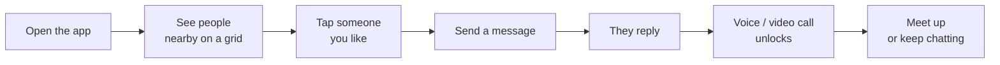
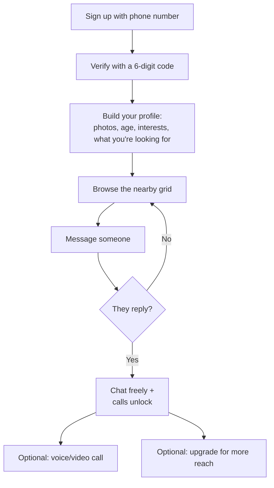
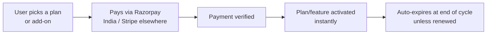

# NearMe — Product Overview

*A plain-English guide for everyone — product, business, operations, support, and partners. No technical knowledge needed.*

---

## What is NearMe?

**NearMe is a mobile app that helps people discover and connect with others who are physically nearby, in real time.**

Instead of the old dating-app pattern of *swipe → match → maybe message someday*, NearMe flips it around:

> **See who's around you → say hello → start chatting → call or meet up.**

You open the app and immediately see a live grid of real people near you. You can message anyone, and conversations can grow into voice or video calls. Safety, privacy, and verification are built into every step.

---

## Who is it for?

- People who want to **meet others nearby right now** — socially or romantically.
- Communities who value **safety and identity verification** before connecting.
- Users who want **control over their privacy** — who can see them, how visible they are, and how much distance detail is shared.

---

## The big idea in one picture

The key rule: **calling only becomes available after the other person has replied at least once.** This stops spam and one-sided pestering — both people have to show interest first.

---

## What makes NearMe different

| Principle | What it means for users |
|---|---|
| **Proximity-first** | The home screen is a live map of real people near you, ranked so the most relevant and active show first. |
| **Reply-gated calling** | You can't call someone until they've replied — connection has to be mutual. |
| **Privacy by design** | Your exact location is **never** shared. Others only see a fuzzy distance like "1.2 km away." You can go incognito, hide your distance, or vanish from the grid instantly. |
| **Verified & trusted** | Phone, photo, face, and even college verification build trust. Bad actors get reported, reviewed, and auto-banned. |
| **Safe by default** | Block, mute, report, and a one-tap "panic hide" that removes you from view immediately. |
| **Fair monetization** | A generous free tier, with paid plans (Premium, Gold, Platinum) and one-off add-ons (boosts, extra call minutes) for people who want more reach and features. |

---

## How people use it (the journey)

1. **Join** — sign up with a phone number, confirm a 6-digit code. No passwords.
2. **Set up** — add photos, age, what you're into, and what you're looking for.
3. **Discover** — see a grid of nearby people; filter by age, interests, and more.
4. **Connect** — message anyone; once they reply, you can call.
5. **Stay safe** — verify yourself, block/report anyone, control your visibility.
6. **Upgrade (optional)** — unlock bigger reach, more filters, calls, and extras.

---

## The plans (at a glance)

| Plan | Who it's for | Headline perks |
|---|---|---|
| **Free** | Everyone starts here | Browse nearby, message up to 20 people total, limited daily call minutes |
| **Premium** | Active users | Unlimited messaging, more profile space, worldwide "Explore" search, typing indicators |
| **Gold** | Power users | Everything in Premium + "who viewed me," incognito mode, call history, pinned chats, travel mode |
| **Platinum** | Top tier | Everything in Gold + AI features (icebreakers, reply suggestions, daily curated picks, profile optimizer) |

**Add-ons** (one-time purchases, any plan): profile **boosts** (appear higher in the grid for a while), **spotlight**, **extra call minutes**, **travel passes**, and a **verified badge**.

---

## How money flows

Payments are handled by trusted providers (Razorpay in India, Stripe elsewhere). When a subscription period ends, the account automatically returns to Free unless renewed.

---

## Safety & trust — what's built in

- **Verification** — phone, photo, face, and college-email checks give users a trust badge.
- **Reporting & moderation** — anyone can report bad behavior. The system tracks reports and **automatically bans repeat offenders**. Hate speech is prioritized for review.
- **Content moderation** — messages and images can be automatically screened for abusive or explicit content.
- **Privacy controls** — incognito mode, hide distance, hide last-seen, and a one-tap **panic hide** that instantly removes you from the grid and pauses incoming messages.
- **Location protection** — your precise GPS location never leaves the system; others only see an approximate distance.

---

## The product in one paragraph (for a pitch)

> NearMe is a real-time, location-based social discovery app that lets people see and connect with others nearby instantly. It replaces the slow swipe-and-match model with an immediate, proximity-first grid where messaging is open but calling is reply-gated to ensure mutual interest. Privacy and safety are core: exact locations are never shared, identities are verified, and a robust moderation system auto-bans repeat offenders. A generous free tier drives adoption, while Premium, Gold, and Platinum subscriptions plus à-la-carte boosts and add-ons drive revenue.

---

## Glossary

| Term | Plain meaning |
|---|---|
| **Grid** | The home screen showing a tiled layout of nearby people |
| **Tap** | A lightweight "like" you send someone |
| **Shortlist / Favorite** | Saving someone to revisit later |
| **Intro / conversation** | Starting a chat with someone new |
| **Reply-gated calling** | Calls only unlock after the other person replies |
| **Boost** | A paid bump that makes you appear higher in the grid temporarily |
| **Spotlight** | A premium boost variant for extra visibility |
| **Incognito** | Browse without appearing in others' grids (Gold+) |
| **Panic hide** | One tap to instantly disappear from the grid |
| **Verified badge** | A trust mark earned by verifying phone/photo/face |
| **Expiring photo** | A photo that disappears after being viewed once |
| **Travel mode / City profile** | Set yourself up in another city before you arrive (Gold+) |
| **Add-on** | A one-time purchase (boost, extra call minutes, etc.) |

---

*For a deeper, feature-by-feature walkthrough with diagrams, see `FEATURE_GUIDE.md`.*
